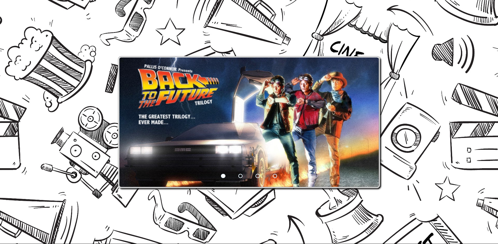
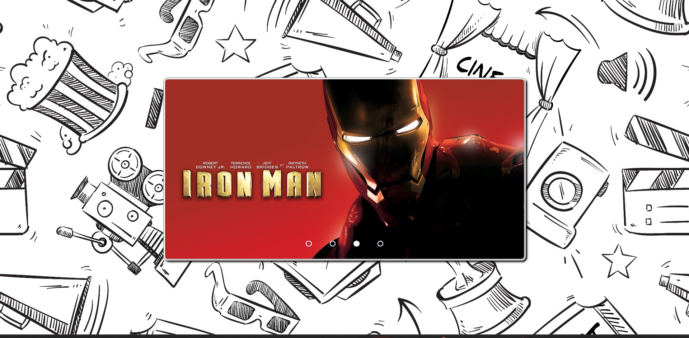

# Slider - Top 5 Best Movies

Deploy: https://slider-blue.vercel.app/

Youtube: https://youtu.be/UOwc0YJGY8A?si=ZcclVaF9MTjpgJNd

## Sobre

It´s a slide transitioning between 4 images of my top 5 favorites movies.

### Objetivos

To learn how to create a slide using HTML, CSS and Javascript.

### Desafio

To understand how a slide works using HTML, CSS and Javascript.

### Conclusão

It was a fun project to do, it´s my first slider and i plan to make others more complex and with more images. I really enjoyed to do this project, it was a great practice to learn my first step towards this kind of application for web development

### Ferramentas Utilizadas

- HTML
- CSS
- Javascript
